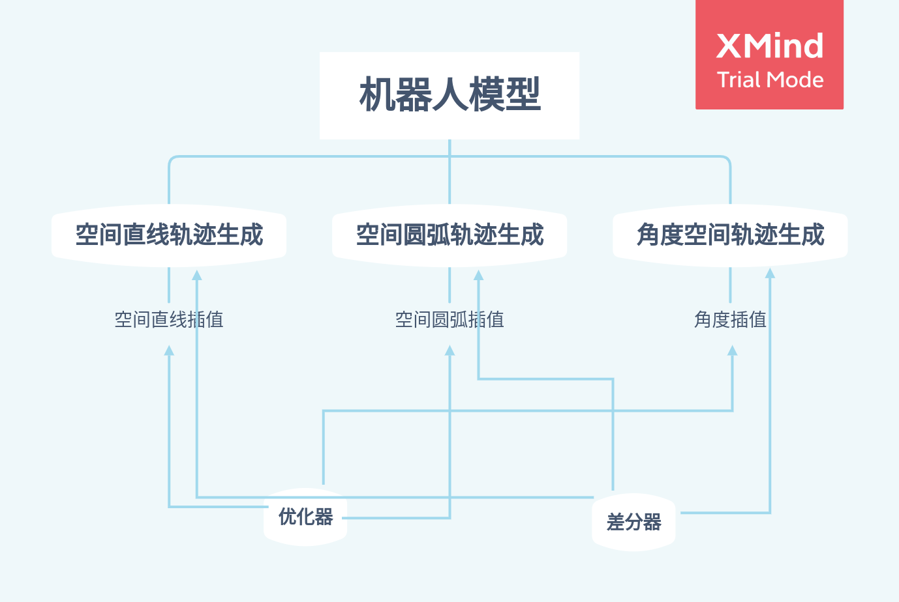
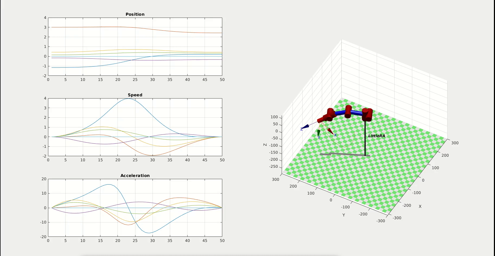
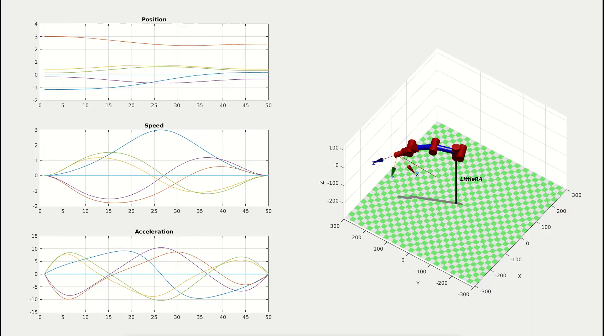

# MathematicalModels
## 介绍
LittleRA建立了一个完整的运动学和动力学模型，并使用Mathematica和基于Matlab的机器人工具箱进行了仿真。你可以在这个文件夹中看到整个数学模型的建造过程，同时，你可以运行相关代码看到其仿真过程。

## 架构

```
.
├── Mathematica                  # 使用wolfram engine完成理论公式的推导
│   └── MathematicalModel.nb
├── MatLab                       # 使用机器人工具箱完成仿真
│   ├── MMSimulation.m           # 程序调用接口
│   ├── README.md
│   ├── Architecture-ZH.xmind    # 项目架构
│   ├── TrajGenerate             # 轨迹生成
│   │   ├── AngleGenerate.m      # 关节角度空间轨迹生成
│   │   ├── AngleInterpol.m
│   │   ├── CircleGenerate.m     # 笛卡尔空间圆弧轨迹生成
│   │   ├── CirInterpol.m
│   │   ├── Diff.m
│   │   ├── LineGenerate.m       # 笛卡尔空间直线轨迹生成
│   │   ├── LineInterpol.m
│   │   └── Optimiza.m           # 轨迹生成方式
│   └── Utils
│       ├── PlotCoordinate.m
│       └── PlotWorkspace.m
├── README.md
└── README-ZH.md
```
其中，Matlab机器人工具箱仿真架构图如下:


## 实例
### 关节角度空间轨迹生成 


### 笛卡尔空间圆弧轨迹生成


### 笛卡尔空间直线轨迹生成


## 依赖
Wolfram Engine 12.2

Robotics Toolbox for MATLAB                           Version 10.4    

## 引用
```
@book{Corke17a, 
Author={PeterI.Corke}, 
Note={ISBN978-3-319-54413-7}, 
Edition={Second}, 
Publisher={Springer}, 
Title={Robotics,Vision\&Control:FundamentalAlgorithmsin{MATLAB}}
```