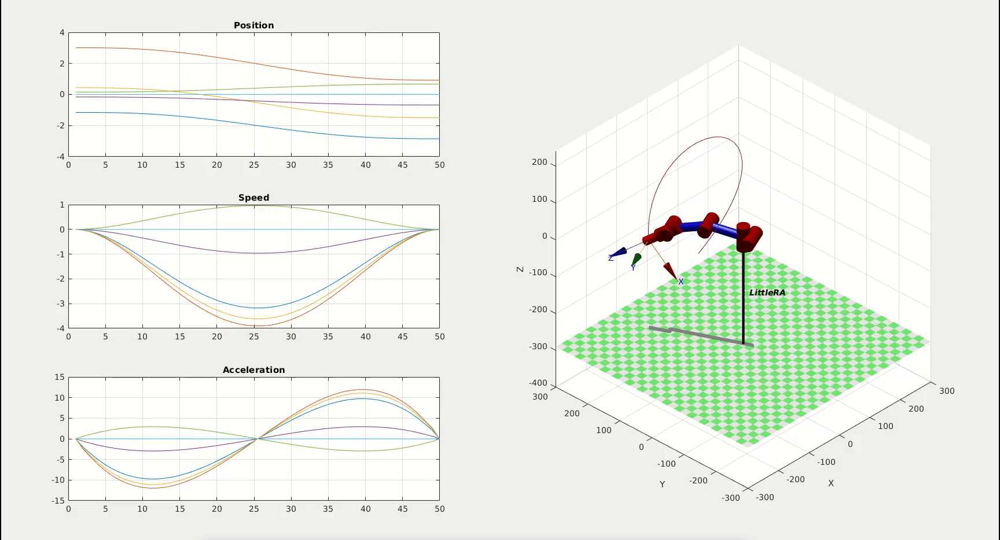

# MathematicalModels
[中文](./README-ZH.md)
## Introduce
LittleRA has built a complete kinematic and dynamics model and simulated it using Mathematica and the Matlab-based Robotics Toolbox. You can see the whole mathematical model construction process in this folder, and at the same time, you can run the related code to see its simulation process.

## Architecture
```
.
├── Mathematica                # Use the wolfram engine to complete the derivation of the theoretical formula
│   └── MathematicalModel.nb
├── MatLab                     # Complete simulation with Robotics Toolbox
│   ├── MMSimulation.m         # Program call interface
│   ├── README.md
│   ├── Architecture-EN.xmind
│   ├── TrajGenerate           # Trajectory generation
│   │   ├── AngleGenerate.m    # Joint angle space trajectory generation
│   │   ├── AngleInterpol.m
│   │   ├── CircleGenerate.m   # Cartesian space arc trajectory generation
│   │   ├── CirInterpol.m
│   │   ├── Diff.m
│   │   ├── LineGenerate.m     # Cartesian space linear trajectory generation
│   │   ├── LineInterpol.m
│   │   └── Optimiza.m         # Track generation method
│   └── Utils
│       ├── PlotCoordinate.m
│       └── PlotWorkspace.m
├── README.md
└── README-ZH.md
```
Among them, the Matlab Robotics Toolbox simulation architecture is illustrated as follows:


## Examples
### Joint angle space trajectory 


### Cartesian space arc trajectory generation


### Cartesian space linear trajectory generation


## Dependence
Wolfram Engine 12.2
Robotics Toolbox for MATLAB                           Version 10.4    
