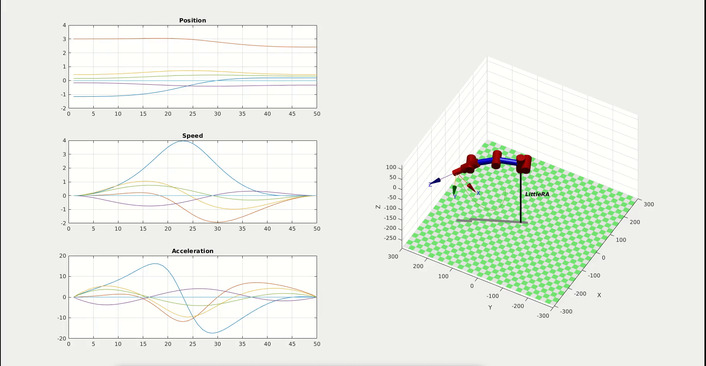

# LittleRA
## 项目介绍

LittleRA是一个多自由机械臂，它来源于我的课程设计，其原本的目的是通过设计一个多自由度机械臂来学习机器人开发过程，同时探索学习一些精巧的，新奇的算法。但是每个人都有追求卓越的心，因此，在我的设想中，LittleRA绝不仅仅用来学习。机械臂也绝不应该是笨笨的傻傻的样子，我希望其可以应用最新的技术，最新的算法。但是，这是个大工程，由于某些限制，要实现这些设想很难。可是我依然很喜欢做这些，单纯的喜欢。

## 项目架构

## 数学模型

在文件家MathematicalModels可以找到全部数学模型的建立和仿真过程，具体详见[数学模型](./MathematicalModels/README-ZH.md)

### Examples

以下是一些轨迹仿真

#### 关节角度空间轨迹生成 

#### 笛卡尔空间圆弧轨迹生成

#### 笛卡尔空间直线轨迹生成

## Intelligence

[TDDO](./TODO)

## Platform

[TDDO](./TODO)

## 愿景

大家玩得开心
