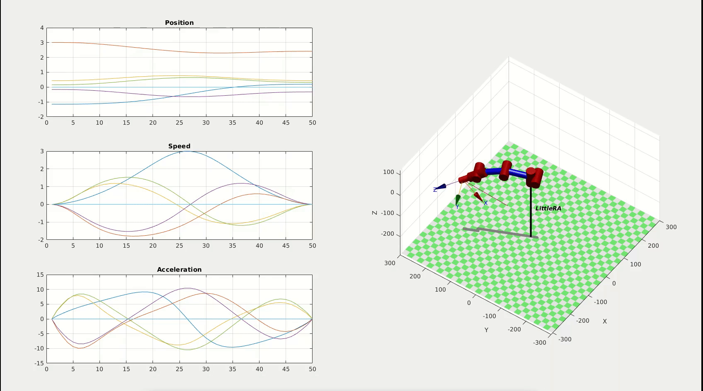

# LittleRA
[中文](./README-ZH.md)
## Project Introduction

LittleRA is a multi-freedom robotic arm that came from my curriculum design, and its original purpose was to learn the robot development process by designing a multi-freedom robotic arm, as well as exploring and learning some nifty and novel algorithms. But everyone has the heart for excellence. So in my vision, LittleRA was never just for learning. The robot arm should never be dumb and silly looking either, I wanted it to be able to apply the latest technology, the latest algorithms. However, it is a huge project, due to certain limitations, it is difficult to realize these visions. But I still love doing this , just simply enjoy the feeling.

## Project Architecture

## Mathematical Model

The full mathematical modeling and simulation process can be found in the document MathematicalModels, as detailed in [Mathematical Model](./MathematicalModels/README.md)

### Examples

Here are some trajectory simulations

#### Joint angle space trajectory 

#### Cartesian space arc trajectory generation

#### Cartesian space linear trajectory generation

## Intelligence

[TDDO](./TODO)

## Platform

[TDDO](./TODO)

## Wishes

Have fun, everybody.

